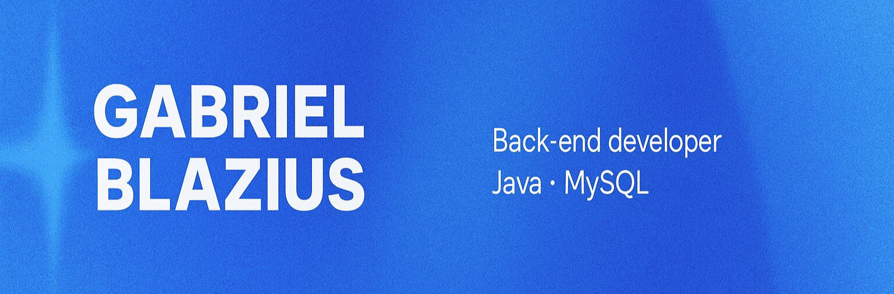

  <a href="https://www.linkedin.com/in/gabriel-blazius-699875346/">Linkedin</a> 
  <a href="https://www.youtube.com/@Blaziusdev">Youtube</a> 
     
  Hello! :) 
  I'm Gabriel Blazius, a Backend Developer with hands-on experience in Java, Spring Boot, and MySQL. I've been actively working on freelance projects, helping businesses bring their backend systems to life with clean code, solid architecture, and reliable performance.

  I’m known for my clear communication and proactive attitude, always taking initiative and seeking to deeply understand the problem before jumping into code. I enjoy collaborating, learning, and supporting a positive and productive work environment.

  Right now, I’m focused on growing as a software engineer and contributing to impactful and challenging projects.

