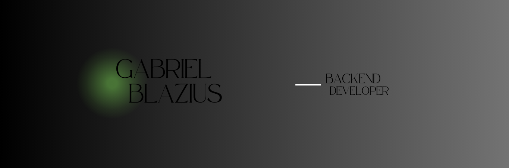

---

## 👨‍💻 Gabriel Blazius

### 🛠️ Sobre mim
- 💻 Programador especializado em **C**, **Java**, **HTML** e **CSS**.
- 🎨 Apaixonado por tecnologia.
- 🚀 Sempre aprendendo algo novo para melhorar minhas habilidades.

---

### 🤖 Linguagens e Tecnologias

 
 

### 🔧 Ferramentas

 
 

---

### 🌐 Conecte-se comigo

    
    
    

---

### 📊 Estatísticas do GitHub

  
  

---
